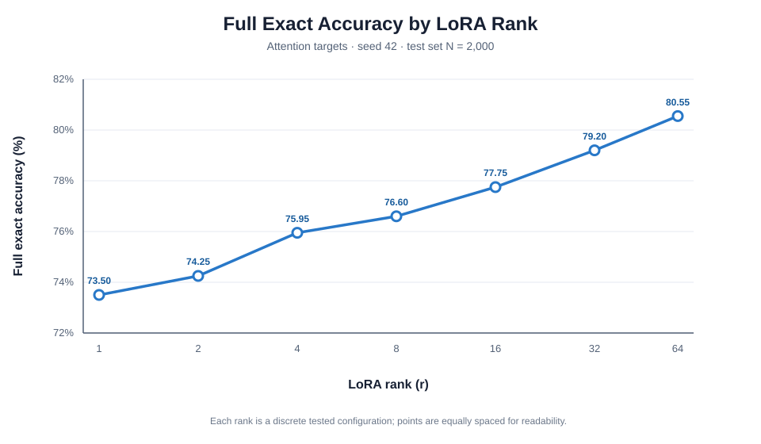
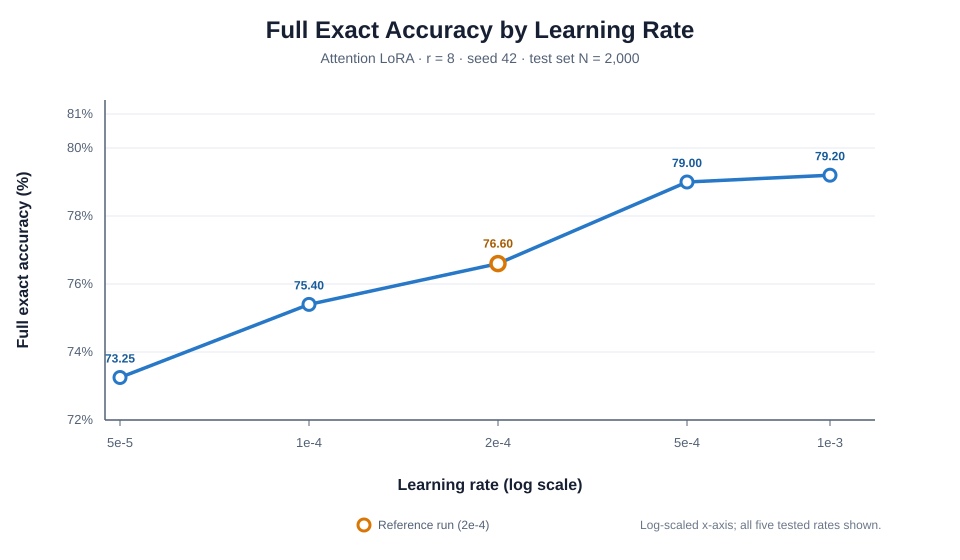

# Experiment Results / 实验结果

## How to read the results / 如何阅读结果

All evaluation scores are percentages from `eval.json`; all runs use the same test set of 2,000 examples. `full_exact` is the primary task metric: both tool name and all arguments must match. Other metrics diagnose where errors occur. Resource values come from each run's `config.json` and `train_summary.json`. A dash means that the quantity does not apply or was not recorded.

所有评估分数均为 `eval.json` 中的比例，以下以百分数呈现；每个 run 使用同一份 2,000 条测试集。`full_exact` 是主要任务指标，要求工具名和全部参数均正确。其他指标用于诊断错误来源。资源数据来自各 run 的 `config.json` 和 `train_summary.json`。破折号表示该项不适用或未记录。

### Metric key / 指标说明

| Metric / 指标   | Meaning / 含义                                                                                                                                                                                                                                   |
| --------------- | ------------------------------------------------------------------------------------------------------------------------------------------------------------------------------------------------------------------------------------------------ |
| `full_exact`    | Correct tool name**and** exact argument dictionary. / 工具名与整个参数字典都完全正确。                                                                                                                                                           |
| `name_correct`  | Correct tool name; arguments may still be wrong. / 工具名正确，但参数仍可能有误。                                                                                                                                                                |
| `args_exact`    | Exact argument dictionary; does not require the tool name to be correct. / 参数字典完全正确，但不要求工具名正确。                                                                                                                                |
| `strict_format` | The entire output is exactly one JSON object. / 整段输出恰好是一个 JSON 对象。                                                                                                                                                                   |
| `json_valid`    | The tolerant parser can extract a JSON object, even if extra text exists. / 宽松解析器能提取 JSON 对象，即使输出可能含额外文字。                                                                                                                 |
| `schema_valid`  | Parsed output has string`name` and dictionary `arguments`; this is a basic shape check, not full tool-argument JSON Schema validation. / 解析结果有字符串 `name` 和字典 `arguments`；这是基本结构检查，不等同于完整的工具参数 JSON Schema 校验。 |
| `val_loss`      | Cross-entropy on target/answer tokens on the validation set; lower is better, but it is not test task accuracy. / 验证集目标答案 token 上的交叉熵，越低越好，但不等于测试任务准确率。                                                            |

`args_exact` and `full_exact` can differ because `args_exact` does not require the tool name to match. The scorer ignores dictionary key order, treats numeric `1` and `1.0` as equal, and keeps booleans distinct from numbers.

`args_exact` 与 `full_exact` 可能不同，因为 `args_exact` 不要求工具名正确。评分时不考虑字典键顺序，将数值 `1` 和 `1.0` 视为相等，但会区分布尔值与数字。

## experiment 1 — Zero-shot model size / 实验一——零样本模型规模

**Question / 探究问题:** How do the two base model sizes compare without fine-tuning? / 不进行微调时，两种尺寸的基座模型表现如何？

| Run / 实验 | Model / 模型          |     N | Full exact / 完全正确 | Name correct / 工具名正确 | Args exact / 参数完全正确 |
| ---------- | --------------------- | ----: | --------------------: | ------------------------: | ------------------------: |
| `e0_0.5b`  | Qwen2.5-0.5B-Instruct | 2,000 |                71.85% |                    96.00% |                    71.90% |
| `e0_1.5b`  | Qwen2.5-1.5B-Instruct | 2,000 |                80.80% |                    98.95% |                    80.90% |

**结论**

1.5B 基座的 `full_exact` 比 0.5B 高 8.95 个百分点，工具名和参数指标也更高。这说明本次测试的 1.5B 模型在该任务上表现更好；由于模型规模之外还可能存在模型差异，不能把差距解释为纯粹的规模因果效应。

The 1.5B baseline is 8.95 percentage points higher than the 0.5B baseline in `full_exact`, with higher tool-name and argument scores as well. The tested 1.5B model performs better on this task, but the difference cannot be attributed solely to model size.

## experiment 2 — LoRA rank / 实验二——LoRA 秩

**Question / 探究问题:** With attention targets and the main training settings fixed, how does rank affect task quality and adapter cost? / 固定 attention 目标及主要训练设置时，rank 如何影响任务效果和 adapter 成本？

| Run / 实验        | Rank`r` | `alpha` | Full exact / 完全正确 | Val loss / 验证 loss | Trainable params / 可训练参数 | Adapter MB |
| ----------------- | ------: | ------: | --------------------: | -------------------: | ----------------------------: | ---------: |
| `e1_attn_r1_s42`  |       1 |       2 |                73.50% |              0.05257 |                       135,168 |       0.57 |
| `e1_attn_r2_s42`  |       2 |       4 |                74.25% |              0.04909 |                       270,336 |       1.09 |
| `e1_attn_r4_s42`  |       4 |       8 |                75.95% |              0.04492 |                       540,672 |       2.12 |
| `e1_attn_r8_s42`  |       8 |      16 |                76.60% |              0.04131 |                     1,081,344 |       4.18 |
| `e1_attn_r16_s42` |      16 |      32 |                77.75% |              0.03871 |                     2,162,688 |       8.31 |
| `e1_attn_r32_s42` |      32 |      64 |                79.20% |              0.03534 |                     4,325,376 |      16.56 |
| `e1_attn_r64_s42` |      64 |     128 |                80.55% |              0.03298 |                     8,650,752 |      33.06 |

**结论**

在已测的七个 rank 中，rank 增大时 `full_exact` 持续上升，验证 loss 持续下降；但可训练参数和 adapter 大小也近似随 rank 增长。r=64 是本次候选中效果最好的 rank，并非已证实的全局最优。若重视部署存储，r=8 的 adapter 为 4.18 MB、`full_exact` 为 76.60%；r=64 的 adapter 为 33.06 MB、`full_exact` 为 80.55%，需要在效果和成本之间权衡。

Across the seven tested ranks, `full_exact` rises and validation loss falls as rank increases; trainable parameters and adapter size also grow approximately with rank. r=64 is the best tested candidate, not a proven global optimum. If deployment storage matters, compare r=8 (4.18 MB, 76.60% `full_exact`) with r=64 (33.06 MB, 80.55%) as a quality-cost trade-off.

## experiment 3 — Seed sensitivity / 实验三——随机种子敏感性

**Question / 探究问题:** How much does the reference attention LoRA (r=8) vary across random seeds? / attention LoRA 参考配置（r=8）在不同随机种子下波动多大？

| Run / 实验                 | Seed | Full exact / 完全正确 | Name correct / 工具名正确 | Args exact / 参数完全正确 |
| -------------------------- | ---: | --------------------: | ------------------------: | ------------------------: |
| `e1_attn_r8_s42`           |   42 |                76.60% |                    99.00% |                    76.75% |
| `e1_attn_r8_s43`           |   43 |                77.55% |                    99.10% |                    77.65% |
| `e1_attn_r8_s44`           |   44 |                76.80% |                    98.95% |                    77.05% |
| **Mean / 均值**            |   — |            **76.98%** |                **99.02%** |                **77.15%** |
| **Sample SD / 样本标准差** |   — |           **0.50 pp** |               **0.08 pp** |               **0.46 pp** |

**结论**

三次运行的 `full_exact` 从 76.60% 到 77.55%，范围为 0.95 个百分点，均值为 76.98%。因此，单次运行的几十分之一个百分点差异不宜轻易解释为配置带来的稳定改进。三 seed 只能初步显示波动，不能给出很精确的不确定性估计。

Across the three runs, `full_exact` ranges from 76.60% to 77.55%, a 0.95-point range, with a mean of 76.98%. Small differences from a single run should not be treated as stable configuration gains. Three seeds provide an initial variability check, not a precise uncertainty estimate.

## experiment 4 — LoRA target modules / 实验四——LoRA 目标模块

**Question / 探究问题:** Does placing LoRA in attention, MLP, or both produce different outcomes? / LoRA 放入 attention、MLP 或两者时，结果有什么差别？

| Run / 实验       | LoRA target / 目标模块 | Micro-batch | Effective batch / 有效 batch | Full exact / 完全正确 | Trainable params / 可训练参数 | Adapter MB | Train min / 分钟 |
| ---------------- | ---------------------- | ----------: | ---------------------------: | --------------------: | ----------------------------: | ---------: | ---------------: |
| `e1_attn_r8_s42` | Attention              |           8 |                           32 |                76.60% |                     1,081,344 |       4.18 |            14.24 |
| `e2_mlp_r8_s42`  | MLP                    |           4 |                           32 |                79.35% |                     3,317,760 |      12.70 |            17.44 |
| `e2_all_r8_s42`  | Attention + MLP        |           4 |                           32 |                79.75% |                     4,399,104 |      16.88 |            20.10 |

**结论**

本次结果中，MLP 与 all 的 `full_exact` 分别比 attention 高 2.75 和 3.15 个百分点；all 比单独 MLP 高 0.40 个百分点。覆盖更多模块也增加了可训练参数、adapter 大小和训练时间，因此 all 的小幅优势伴随更高成本。

In these runs, MLP and all exceed attention in `full_exact` by 2.75 and 3.15 percentage points; all is 0.40 points above MLP alone. Broader module coverage also increases trainable parameters, adapter size, and training time, so the small all-vs-MLP gain comes at additional cost.

## experiment 5 — Full fine-tuning reference / 实验五——全参数微调参照

**Question / 探究问题:** How does the full fine-tuning reference compare with the standard attention LoRA run in quality and training cost? / 全参数微调参照与标准 attention LoRA 在效果和训练成本上有何差别？

| Run / 实验       | Method / 方法                 | Full exact / 完全正确 | Val loss / 验证 loss | Trainable params / 可训练参数 | Train min / 分钟 | Peak memory / 峰值显存 |
| ---------------- | ----------------------------- | --------------------: | -------------------: | ----------------------------: | ---------------: | ---------------------: |
| `e1_attn_r8_s42` | LoRA, attention r=8           |                76.60% |              0.04131 |           1,081,344 (0.2184%) |            14.24 |               18.20 GB |
| `e3_full_s42`    | Full fine-tuning / 全参数微调 |                80.95% |              0.03222 |            494,032,768 (100%) |            22.35 |                9.53 GB |

**结论**

全参数微调比 attention r=8 高 4.35 个百分点，但训练了约 494M 参数，而 LoRA 只训练约 1.08M 参数。全量微调耗时多约 8.11 分钟；这次记录的峰值显存反而低于 LoRA，因此不能根据“可训练参数少”推断本实现中测得的峰值显存一定更低。两者的学习率、weight decay、micro-batch 等设置不同，所以这是参考对比，不是只改变微调方法的严格控制实验。

Full fine-tuning is 4.35 percentage points above attention r=8, but trains about 494M parameters compared with about 1.08M for LoRA. It takes about 8.11 more minutes; its recorded peak memory is lower in this run, so fewer trainable parameters do not imply lower measured peak memory for this implementation. Learning rate, weight decay, and micro-batch also differ, making this a reference comparison rather than a controlled experiment changing only the tuning method.

## experiment 6 — Learning rate / 实验六——学习率

**Question / 探究问题:** How does learning rate affect attention LoRA with r=8? / 对 r=8 attention LoRA，学习率如何影响结果？

| Run / 实验              |  Learning rate / 学习率 | Full exact / 完全正确 | Val loss / 验证 loss | Name correct / 工具名正确 | Args exact / 参数完全正确 |
| ----------------------- | ----------------------: | --------------------: | -------------------: | ------------------------: | ------------------------: |
| `e4_attn_r8_lr5e-5_s42` |                    5e-5 |                73.25% |              0.05212 |                    98.95% |                    73.50% |
| `e4_attn_r8_lr1e-4_s42` |                    1e-4 |                75.40% |              0.04594 |                    98.95% |                    75.60% |
| `e1_attn_r8_s42`        | 2e-4 (reference / 参照) |                76.60% |              0.04131 |                    99.00% |                    76.75% |
| `e4_attn_r8_lr5e-4_s42` |                    5e-4 |                79.00% |              0.03610 |                    99.20% |                    79.20% |
| `e4_attn_r8_lr1e-3_s42` |                    1e-3 |                79.20% |              0.03786 |                    98.95% |                    79.30% |

**结论**

在这些候选中，学习率从 5e-5 增至 5e-4 时，`full_exact` 持续上升、验证 loss 持续下降；到 1e-3 时，测试分数只再增加 0.20 个百分点，验证 loss 反而略高。1e-3 是测试准确率最高的已测点，5e-4 则有略低测试分数和更低验证 loss。应把两者视为值得用 validation 和更多 seed 复核的候选，不能据当前 test 上的细微差异断定谁稳定更优。

Among these candidates, increasing the learning rate from 5e-5 to 5e-4 steadily raises `full_exact` and lowers validation loss. At 1e-3, test accuracy rises by only 0.20 points while validation loss becomes slightly higher. The 1e-3 run has the best observed test score; 5e-4 has a marginally lower test score and lower validation loss. Recheck both with validation and more seeds rather than treating the small test difference as a stable ranking.

## experiment 7 — Handwritten LoRA vs PEFT / 实验七——手写 LoRA 与 PEFT

**Question / 探究问题:** Do the handwritten LoRA and PEFT implementations give comparable results under the reference setup? / 在参考设置下，手写 LoRA 与 PEFT 实现是否得到相近结果？

| Run / 实验            | Implementation / 实现        | Full exact / 完全正确 | Val loss / 验证 loss | Train min / 分钟 | Adapter MB |
| --------------------- | ---------------------------- | --------------------: | -------------------: | ---------------: | ---------: |
| `e1_attn_r8_s42`      | Handwritten LoRA / 手写 LoRA |                76.60% |              0.04131 |            14.24 |       4.18 |
| `e5_peft_attn_r8_s42` | PEFT                         |                76.50% |              0.04130 |            14.44 |       4.18 |

**结论**

两者的 `full_exact` 只差 0.10 个百分点，验证 loss 和 adapter 大小也几乎相同。本次实验支持“这两个实现得到相近结果”。

The two implementations differ by only 0.10 percentage points in `full_exact`, with nearly identical validation loss and adapter size. This run supports the limited conclusion that they produced similar results here.
